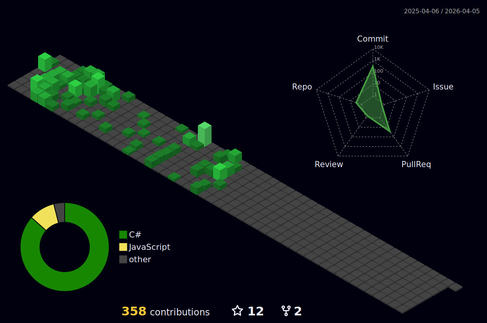

  
  
   
   
   
  
  

    

      
    

    

      
    

    

      
    

  

   
   
   
  
  

    
  

   
   
   

  <table>
    <thead>
      <tr>
        <th colspan="2">
          

            
          

        </th>
      </tr>
    </thead>
  <tbody>
    <tr>
      <td>
        

          &nbsp
          &nbsp
          &nbsp
            
          &nbsp
            <strong  align="center">
              StackOverflow
            </strong>
        

      </td>
      <td>
        &nbsp
        &nbsp
        &nbsp
        &nbsp
        &nbsp
        &nbsp
        &nbsp
        &nbsp
        &nbsp
        &nbsp
        
      </td>
    </tr>
    <tr>
      <td>
        <strong>
          Programming Languages
        </strong>
      </td>
      <td>
        

          
        

      </td>
    </tr>
    <tr>
      <td>
        <strong>
          Frameworks & Databases
        </strong>
      </td>
      <td>
        

          
        

      </td>
    </tr>
    <tr>
      <td>
        <strong>
          Operating Systems, Cloud, & IoT
        </strong>
      </td>
      <td>
        

          
        

      </td>
    </tr>
    <tr>
      <td colspan="2">
        

            
        

      </td>
    </tr>
  </tbody>
</table>

 
 

# Top projects

* ## ThetaDrive 📁
  * ThetaDrive is an open-source alternative to Google Drive. 🔒 It has multiple security features such as: **Two-Step authentication**, **SHA-256 file encryption**, **encrypted local storage**, and many more. 🌐📁Theta FTP can perform multiple FTP features such as: ⬆️**file upload**, ⬇️**file download**, 📁**directory creation**, 📁🔀**file/directory relocation**, and 📂✏️**file/directory rename**.
  * **Repository Link:** https://github.com/CSharpTeoMan911/ThetaFTP
  * **Wiki link:** https://github.com/CSharpTeoMan911/ThetaFTP/wiki
  * **Live Website link:** https://theta-drive.org

* ## Eva the AI assistant 🧠🤖
  * Eva is an open-source AI assistant. It is using 🗣️🤖 NLP powered speech recognition and a Natural Language Understanding engine to clasify and execute voice commands. The application can: 📲💻 open applications, 📱❌ close applications, 🔧🖥️ interact with the OS settings, 📷 take screenshots, 🤖 give queries to ChatGPT, ⏰ set timers, and 🔍🌐 search content on web applications. 
  * **Repository Link:** https://github.com/CSharpTeoMan911/Eva
  * **Wiki link:** https://github.com/CSharpTeoMan911/Eva/wiki
  * **SourceForge:** https://sourceforge.net/projects/eva-ai/
 
* ## WeatherPrediction 🌤️
  * WeatherPrediction🌤️ is a ⚛️**React Native** weather forecasting app powered by 🤖 machine learning that predicts 🌡️temperatures for Global and London locations. The app predicts the 🌡️average temperature between the maximum and minimum values for a given day. The app uses an embedded 📈**Polynomial Multivariate Linear Regression** machine learning model that is built in 🐍**Python** using **Scikit Learn**, **Pandas**, and **Numpy**. The model is running in 🐍**Python** which, is subsequently running natively in the browser using 🕸️⚙️**WebAssembly** and doing interop with the main ⚛️**React Native** application using 🕸️👷**Web Workers** for distributing the processing load across multiple threads.
  * **Repository Link:** https://github.com/CSharpTeoMan911/WeatherPrediction
  * **Live Website link:** https://weatherprediction-d3c67.web.app

